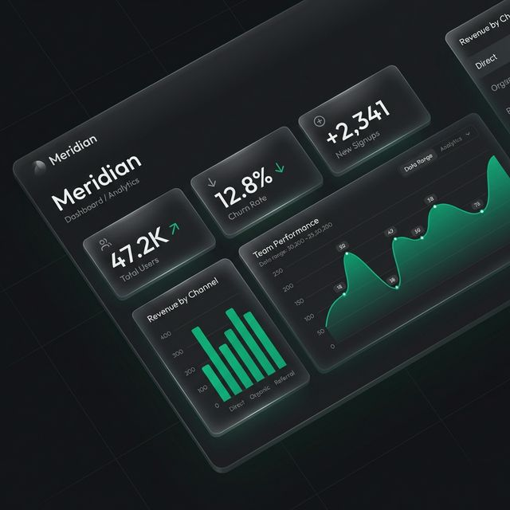

# Meridian — SaaS Landing Page Template



> A premium, zero-build SaaS landing page template crafted by **[@Tresorkaseka](https://github.com/Tresorkaseka)**. Open any browser, drag `index.html` — done.

---

## 🇬🇧 English

### What is Meridian?

**Meridian** is a high-end SaaS landing page template built with a **design-first philosophy**. It demonstrates that you don't need a heavy JavaScript framework or a complex build pipeline to ship a stunning, production-quality product page.

This template is free to use, fork, and customise for your own SaaS projects.

### Tech Stack

| Layer | Technology | Why |
|---|---|---|
| Structure | **HTML5** (semantic) | Zero dependencies, opens instantly in any browser |
| Styling | **Vanilla CSS** (custom properties) | Full control, no framework overhead |
| Animation | **GSAP 3 + ScrollTrigger** (CDN) | Professional-grade scroll animations & sequences |
| Icons | **Phosphor Icons** (CDN) | Consistent, lightweight SVG icon system |
| Fonts | **Google Fonts** — Outfit + JetBrains Mono | Premium typography, no Inter |

> No Node.js · No npm · No build step · No framework · No bundler

### Features

- **Floating glassmorphism navbar** — blurs dynamically on scroll
- **Asymmetric Hero section** — Split layout (content left / dashboard visual right) with 3D perspective frame
- **Text scramble effect** — Headline cycles through phrases with a matrix decode animation
- **Infinite CSS marquee** — Trust bar with company logos, pauses on hover
- **Bento feature grid** — Asymmetric `2fr 1fr 1fr` layout (taste-skill compliant, no 3-equal-cards)
  - Live sparkline bar chart (oscillates every 800ms)
  - AI query typewriter cycling through 5 prompts
  - Integration chips, metric counters, security badges
- **Animated stat counters** — easeOutQuad count-up triggered by scroll
- **Testimonials masonry** — Featured card spans 2 rows
- **3-tier pricing section** — Featured plan with accent highlight
- **CTA with animated mesh gradient blobs**
- **Card 3D tilt** — Subtle rotateX/Y tracking mouse position (desktop only)
- **GSAP hero entrance + blob parallax** on scroll
- **Fully responsive** — collapses cleanly at 375px, 640px, 1024px
- **`prefers-reduced-motion` respected** — no forced animations for accessibility

### Design Principles

This template was built following the **taste-skill™** frontend design philosophy:

- `DESIGN_VARIANCE: 8` — Asymmetric layouts, masonry, fractional grids
- `MOTION_INTENSITY: 6` — CSS cubic-bezier transitions + GSAP reveals
- `VISUAL_DENSITY: 4` — Balanced whitespace, daily-app feel
- Accent: **Emerald `#10b77f`** (desaturated ~70%) on **Zinc-950 `#09090b`** base
- No Inter font (Outfit + JetBrains Mono instead)
- No centered hero, no 3-equal-card layouts, no neon glows, no pure black

### Getting Started

```bash
# Clone the repo
git clone https://github.com/Tresorkaseka/Meridian_templaye_by_me.git

# Navigate to the project
cd Meridian_templaye_by_me

# Open in your browser — no build step needed
start index.html       # Windows
open index.html        # macOS
xdg-open index.html    # Linux
```

That's it. No `npm install`, no `node_modules`, no waiting.

### Project Structure

```
Meridian_templaye_by_me/
├── index.html          # Full page structure (all sections)
├── src/
│   ├── style.css       # Design system + all component styles
│   └── main.js         # Animations: GSAP, typewriter, scramble, counters
├── public/
│   ├── dashboard.png   # Hero dashboard mockup image
│   └── flow.png        # Bento grid illustration
└── README.md           # This file
```

### Customisation Guide

| What to change | Where |
|---|---|
| Brand name & logo | `index.html` → `<nav>` + `<footer>` |
| Accent color | `src/style.css` → `--c-accent` CSS variable |
| Hero headline | `index.html` → `.hero__headline` |
| Typewriter prompts | `src/main.js` → `queries` array |
| Text scramble phrases | `src/main.js` → `phrases` array |
| Section content | Edit directly in `index.html` |
| Fonts | Replace Google Fonts `<link>` in `index.html` `<head>` |

### License

MIT — free to use for personal and commercial projects. Attribution appreciated but not required.

---

## 🇫🇷 Français

### C'est quoi Meridian ?

**Meridian** est un template de landing page SaaS haut de gamme conçu avec une **philosophie design-first**. Il prouve qu'on n'a pas besoin d'un framework JavaScript lourd ou d'une pipeline de build complexe pour livrer une page produit magnifique et de qualité production.

Ce template est libre d'utilisation, de fork et de personnalisation pour vos projets SaaS.

### Stack Technique

| Couche | Technologie | Pourquoi |
|---|---|---|
| Structure | **HTML5** (sémantique) | Zéro dépendance, s'ouvre immédiatement dans n'importe quel navigateur |
| Style | **Vanilla CSS** (custom properties) | Contrôle total, sans surcharge de framework |
| Animation | **GSAP 3 + ScrollTrigger** (CDN) | Animations au scroll de niveau professionnel |
| Icônes | **Phosphor Icons** (CDN) | Système d'icônes SVG cohérent et léger |
| Polices | **Google Fonts** — Outfit + JetBrains Mono | Typographie premium, pas d'Inter |

> Pas de Node.js · Pas de npm · Pas de build · Pas de framework · Pas de bundler

### Fonctionnalités

- **Navbar glassmorphism flottante** — s'assombrit dynamiquement au scroll
- **Hero asymétrique** — Layout split (contenu à gauche / visuel dashboard à droite) avec cadre en perspective 3D
- **Effet text scramble** — Le titre cycle entre des phrases avec une animation de décodage matriciel
- **Marquee CSS infini** — Bande de confiance avec logos d'entreprises, s'arrête au survol
- **Bento grid features** — Layout asymétrique `2fr 1fr 1fr` (sans 3 cartes égales)
  - Graphique sparkline live (oscille toutes les 800ms)
  - Typewriter de requêtes AI en cycle sur 5 phrases
  - Chips d'intégrations, compteurs de métriques, badges de sécurité
- **Compteurs statistiques animés** — Count-up easeOutQuad déclenché au scroll
- **Testimonials en masonry** — La carte featured occupe 2 lignes
- **Section pricing 3 tiers** — Plan vedette avec bordure accent
- **CTA avec blobs de gradient mesh animés**
- **Tilt 3D sur les cartes** — rotateX/Y subtil suivant la position de la souris (desktop uniquement)
- **Entrée GSAP hero + parallax** sur les blobs au scroll
- **Entièrement responsive** — collapse proprement à 375px, 640px, 1024px
- **`prefers-reduced-motion` respecté** — aucune animation forcée pour l'accessibilité

### Philosophie de Design

Ce template a été construit en suivant la philosophie **taste-skill™** :

- `DESIGN_VARIANCE: 8` — Layouts asymétriques, masonry, grilles fractionnelles
- `MOTION_INTENSITY: 6` — Transitions CSS cubic-bezier + reveals GSAP
- `VISUAL_DENSITY: 4` — Espacement équilibré, feel d'app quotidienne
- Accent : **Emerald `#10b77f`** (saturation ~70%) sur base **Zinc-950 `#09090b`**
- Pas de police Inter (Outfit + JetBrains Mono à la place)
- Pas de hero centré, pas de 3 cartes égales, pas de glow neon, pas de noir pur

### Démarrage Rapide

```bash
# Cloner le repo
git clone https://github.com/Tresorkaseka/Meridian_templaye_by_me.git

# Aller dans le projet
cd Meridian_templaye_by_me

# Ouvrir dans le navigateur — aucun build nécessaire
start index.html       # Windows
open index.html        # macOS
xdg-open index.html    # Linux
```

C'est tout. Pas de `npm install`, pas de `node_modules`, pas d'attente.

### Structure du Projet

```
Meridian_templaye_by_me/
├── index.html          # Structure complète de la page (toutes les sections)
├── src/
│   ├── style.css       # Système de design + tous les styles de composants
│   └── main.js         # Animations : GSAP, typewriter, scramble, compteurs
├── public/
│   ├── dashboard.png   # Image mockup dashboard du Hero
│   └── flow.png        # Illustration de la bento grid
└── README.md           # Ce fichier
```

### Guide de Personnalisation

| Quoi modifier | Où |
|---|---|
| Nom de marque & logo | `index.html` → `<nav>` + `<footer>` |
| Couleur accent | `src/style.css` → variable CSS `--c-accent` |
| Titre du Hero | `index.html` → `.hero__headline` |
| Phrases du typewriter | `src/main.js` → tableau `queries` |
| Phrases du text scramble | `src/main.js` → tableau `phrases` |
| Contenu des sections | Modifier directement dans `index.html` |
| Polices | Remplacer le `<link>` Google Fonts dans le `<head>` de `index.html` |

### Licence

MIT — libre d'utilisation pour projets personnels et commerciaux. Attribution appréciée mais non obligatoire.

---

*Made with precision by [@Tresorkaseka](https://github.com/Tresorkaseka)*
